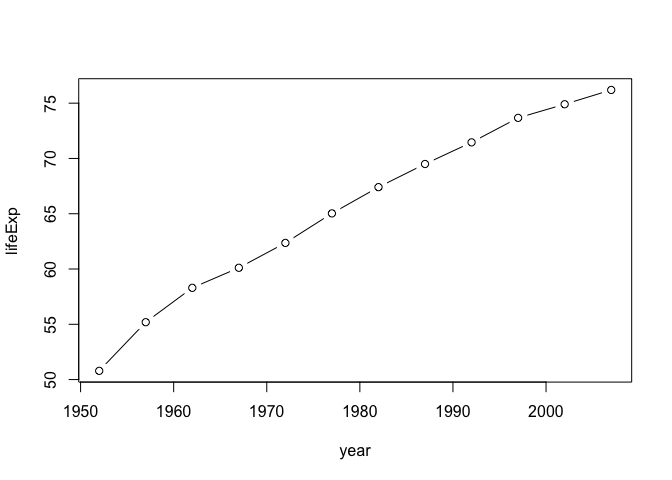
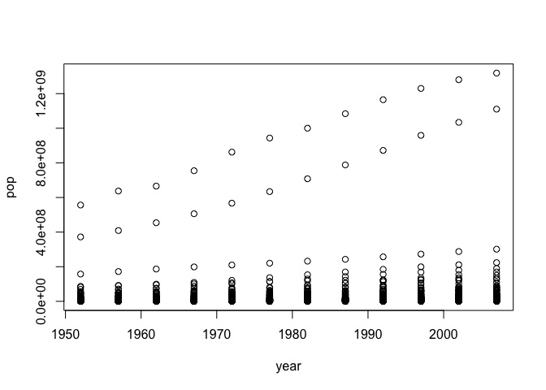

Alejandra\_hw01\_gapminder
================

## Gapminder Exploration

This is an R Markdown document used for exploring a dataset using basic
R functions. Here I used gapminder data, which includes data on life
expectancy, GDP per capita, and population by country.

## R Code

I included R code to explore the data set.

First, we need to install the gapminder package:

``` r
install.packages("gapminder", repos = "http://cran.us.r-project.org")
```

    ## 
    ## The downloaded binary packages are in
    ##  /var/folders/64/_h0srt_n7r3dvcwdhrw9rp780000gn/T//RtmplYGcDb/downloaded_packages

Loading the gapminder dataset afer installing the package:

``` r
library(gapminder)
```

Now I want to know the class of the data, a summary of it and the first
few values to have an idea of which type of data am I dealing with:

``` r
class(gapminder)
```

    ## [1] "tbl_df"     "tbl"        "data.frame"

``` r
summary(gapminder)
```

    ##         country        continent        year         lifeExp     
    ##  Afghanistan:  12   Africa  :624   Min.   :1952   Min.   :23.60  
    ##  Albania    :  12   Americas:300   1st Qu.:1966   1st Qu.:48.20  
    ##  Algeria    :  12   Asia    :396   Median :1980   Median :60.71  
    ##  Angola     :  12   Europe  :360   Mean   :1980   Mean   :59.47  
    ##  Argentina  :  12   Oceania : 24   3rd Qu.:1993   3rd Qu.:70.85  
    ##  Australia  :  12                  Max.   :2007   Max.   :82.60  
    ##  (Other)    :1632                                                
    ##       pop              gdpPercap       
    ##  Min.   :6.001e+04   Min.   :   241.2  
    ##  1st Qu.:2.794e+06   1st Qu.:  1202.1  
    ##  Median :7.024e+06   Median :  3531.8  
    ##  Mean   :2.960e+07   Mean   :  7215.3  
    ##  3rd Qu.:1.959e+07   3rd Qu.:  9325.5  
    ##  Max.   :1.319e+09   Max.   :113523.1  
    ## 

``` r
head(gapminder)
```

    ## # A tibble: 6 x 6
    ##   country     continent  year lifeExp      pop gdpPercap
    ##   <fct>       <fct>     <int>   <dbl>    <int>     <dbl>
    ## 1 Afghanistan Asia       1952    28.8  8425333      779.
    ## 2 Afghanistan Asia       1957    30.3  9240934      821.
    ## 3 Afghanistan Asia       1962    32.0 10267083      853.
    ## 4 Afghanistan Asia       1967    34.0 11537966      836.
    ## 5 Afghanistan Asia       1972    36.1 13079460      740.
    ## 6 Afghanistan Asia       1977    38.4 14880372      786.

n\_obs$countries

``` r
plot(lifeExp ~ year, gapminder, subset = country == "Mexico", type ="b")
```

<!-- -->

## Including Plots

``` r
year <- gapminder[3]
pop <- gapminder[5]

data<- data.frame(year,pop)
plot(data)
```

<!-- -->

You can also embed plots, for example:

<!-- -->

Note that the `echo = FALSE` parameter was added to the code chunk to
prevent printing of the R code that generated the plot.
